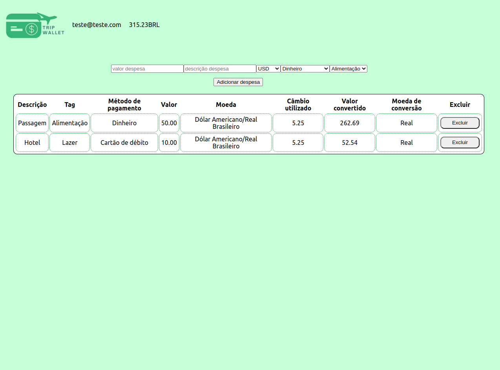

# Boas-vindas ao repositório do projeto Trip_Wallet!

  
<strong>👨‍💻 O que foi desenvolvido</strong>
 

  Neste projeto foi desenvolvido uma carteira de controle de gastos de viagem com um conversor de moedas, o projeto teve como base o projeto TrabeWallet do curso de desenvolvimento Web da Trybe, ao utilizar essa aplicação o usuário é ser capaz de:

  - Adicionar e remover um gasto;
  - Visualizar uma tabelas com seus gastos;
  - Visualizar o total de gastos convertidos para o Real;

  
  

  
<strong>:memo: Habilidades avaliadas pela Trybe</strong>
 

- Criar um _store_ Redux em aplicações React

- Criar _reducers_ no Redux em aplicações React

- Criar _actions_ no Redux em aplicações React

- Criar _dispatchers_ no Redux em aplicações React

- Conectar Redux aos componentes React

- Criar _actions_ assíncronas na sua aplicação React que faz uso de Redux.

